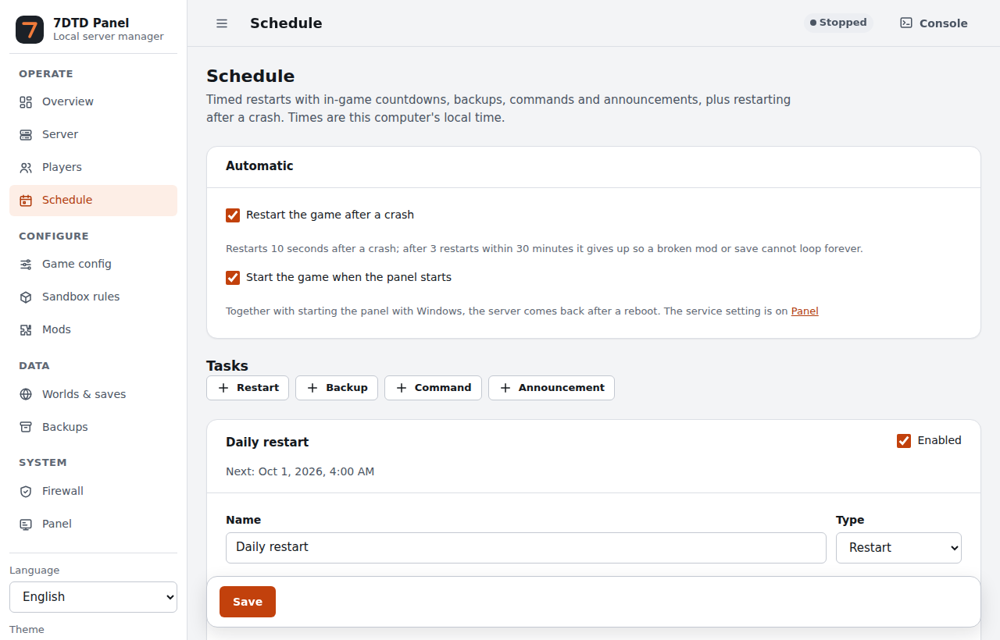
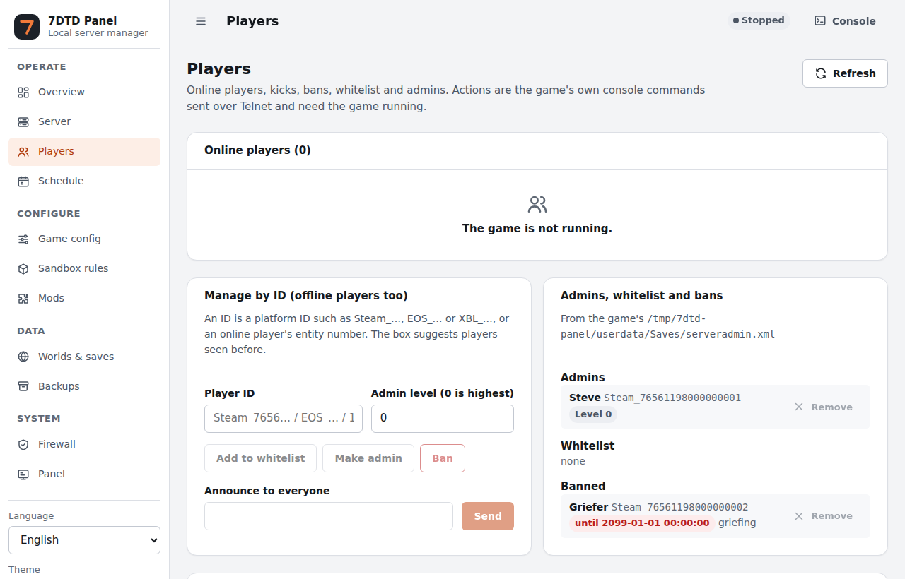
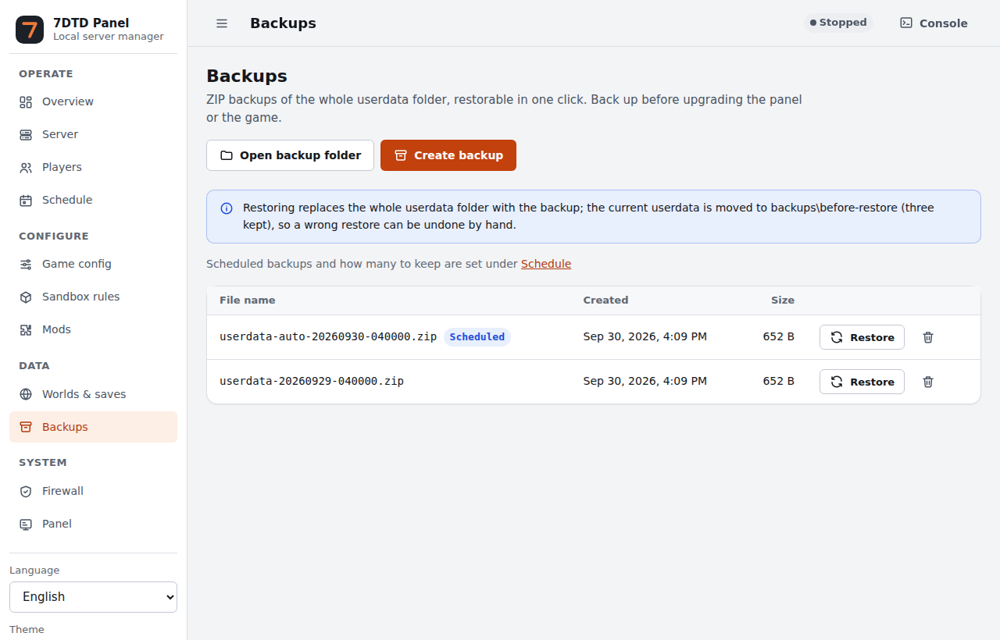

# 7DTD Panel

[简体中文](README.md) | English

Author: **NightowlHaohao**

A local web panel for running a **7 Days to Die dedicated server on Windows**. One `panel.exe`:
double-click it and use it in your browser — no database, web server or runtime to install.

## Features

- **Start / stop**: graceful stop (saves over Telnet, then exits) and force stop, live log, console commands.
- **Players**: online players, private messages, kicks, timed bans, whitelist, admins, announcements; offline players too.
- **Schedule**: timed restarts with in-game countdowns, automatic backups, timed commands and announcements; restart after a crash.
- **Backups and restore**: back up the whole userdata folder and restore it in one click, even while the game runs.
- **Game config and sandbox rules**: edit `serverconfig.xml` with translated labels, keeping the file's formatting and comments.
- **Mods**: install from a ZIP, enable / disable, dependency checks.
- **Worlds and saves**: switch, export, import, delete.
- **Updates**: update the game through SteamCMD on the stable, experimental or a pinned older branch; reminders for new versions.
- **Windows service and autostart**: keep the panel running in the background and bring the server back after a reboot.
- **Firewall**: preview and apply inbound rules for the game ports.
- **Performance**: CPU, GPU, memory and game-process charts.
- Simplified Chinese / Traditional Chinese / English, light / dark theme.

The panel listens on `127.0.0.1` only and never exposes its web page to the network; every change needs
a random token from the page.

| Players | Backups |
|---|---|
|  |  |

## Quick start

1. Download the latest `7dtd-panel-<version>-windows-x64.zip` from [Releases](../../releases) (x64 = 64-bit Windows) and extract it to a folder.
2. Put the 7 Days to Die dedicated server files into that folder's `server\`, or download them later from the Server page with SteamCMD.
3. Double-click `panel.exe`; the panel opens in your browser.
4. On Overview, create the data folders; on Game config, check the world, save name, ports and passwords, then start the server.
5. To keep the panel running in the background, click "Install service and switch" on the Panel page (one administrator prompt) and, if you like, "Start the panel with Windows".

Windows may show "Windows protected your PC" (SmartScreen) because the program is not code-signed; click "More info → Run anyway".

## Upgrading

1. Make a backup on the Backups page.
2. Click "Stop panel" on the Panel page.
3. Extract the new version **over** the same folder (`panel.json`, `server`, `userdata`, `backups` are kept).
4. Double-click the new `panel.exe`. If the service is installed and the new version is in another folder, one administrator prompt updates the service to the new program.

Upgrading from v1.0.0: since v1.1.0 the scripts in `scripts\` are no longer needed. If you installed the
service with `安装服务.bat`, remove it with the old `卸载服务.bat` first, then install it again from the Panel page.

## Documentation

- [User guide](docs/user-guide.en.md): every page and feature in detail (service, firewall, backups, schedule, mods, SandboxCode …).
- [Development](docs/development.en.md): building, testing and releasing.
- [Roadmap](docs/ROADMAP.en.md): what is done and what is planned.
- [Security](SECURITY.md): how to report a security problem.

## FAQ

**Does closing the panel stop the game?** No. Stopping the panel stops only the web page and scheduled tasks; the game keeps running.

**The browser did not open?** Check `logs\panel.log` or open `http://127.0.0.1:8787` (the port can be changed in `panel.json`).

**The Firewall page can only preview?** As a service the panel has no administrator rights. Stop the panel on the Panel page,
right-click `panel.exe` → "Run as administrator", apply the rules, close it, then double-click `panel.exe` to return to the service.

**Can I use NaiwaziBot?** Yes. Upload its ZIP on the Mods page; the Players page detects it and opens its web panel.
NaiwaziBot is third-party freeware (not open source); this panel includes none of its files.

## License

Copyright (C) 2026 NightowlHaohao

This project is open source under the [GNU AGPL-3.0](LICENSE):

- ✅ Anyone may use, change and share it for free, including commercially (server owners may take donations or sell VIP).
- 📢 If you **distribute** a modified version, or let others **use a modified version over a network** (for example a
  hosting provider offering a changed panel to its customers), you must publish its complete source under the same AGPL-3.0.
- Keep the copyright and licence notices; the software comes without any warranty.

This is a summary; the [LICENSE](LICENSE) text is authoritative. Third-party licences are in [THIRD_PARTY_NOTICES.md](THIRD_PARTY_NOTICES.md).

"7 Days to Die" is a trademark of The Fun Pimps; this project is not affiliated with The Fun Pimps.
