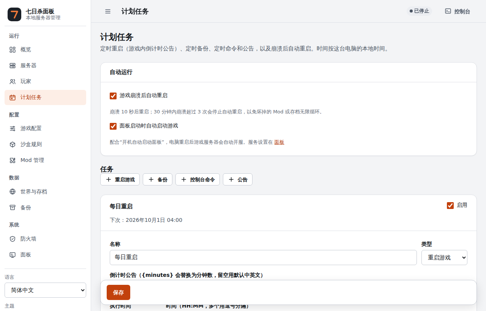
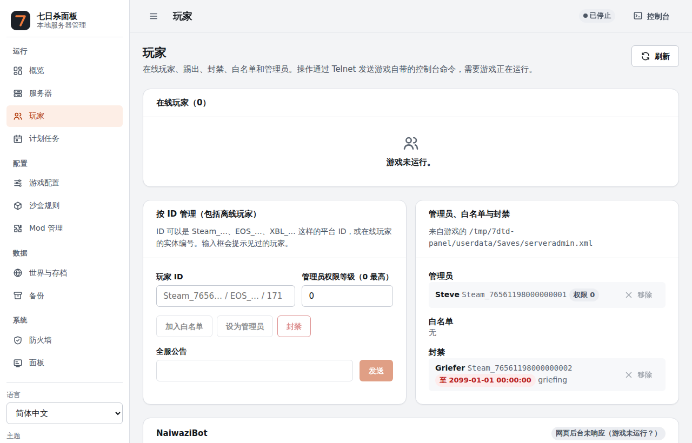
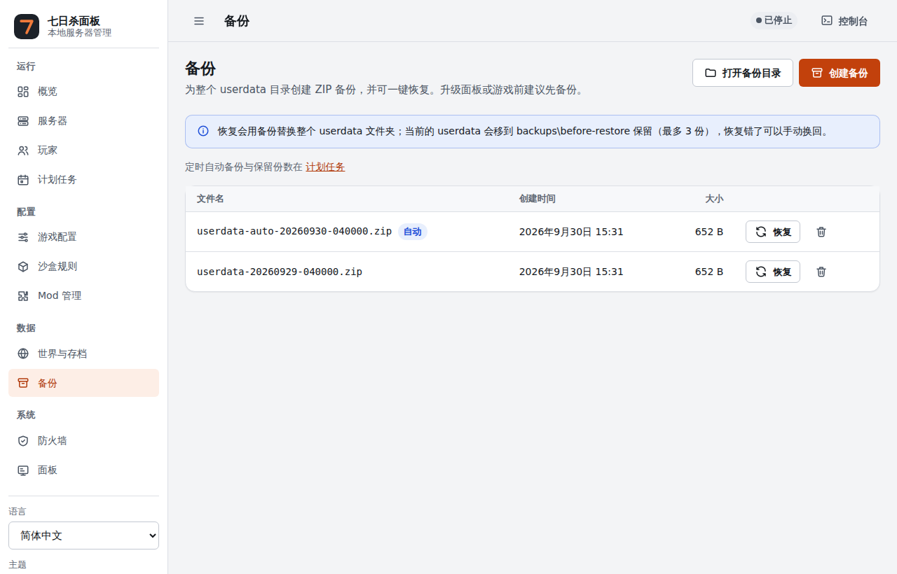

# 七日杀本地管理面板（7DTD Panel）

简体中文 | [English](README.en.md)

作者：**NightowlHaohao**

在 Windows 上管理 **七日杀（7 Days to Die）专用服务器** 的本地网页面板。一个 `panel.exe`，
双击即可使用，不需要安装数据库、网页服务器或其他运行环境。

## 功能

- **启动 / 停止**：正常停止（通过 Telnet 保存后退出）与强行停止，实时日志、控制台命令。
- **玩家管理**：在线玩家、私聊、踢出、限时封禁、白名单、管理员、全服公告；可对离线玩家操作。
- **计划任务**：定时重启（游戏内倒计时公告）、自动备份、定时命令与公告；崩溃后自动重启。
- **备份与恢复**：整个存档目录一键备份、一键恢复，运行中也能备份。
- **游戏配置与沙盒规则**：中英对照编辑 `serverconfig.xml`，保留原文件格式和注释。
- **Mod 管理**：上传 ZIP 安装、启用 / 停用、依赖检查。
- **世界与存档**：切换、导出、导入、删除。
- **更新**：通过 SteamCMD 更新游戏，可选稳定版、实验版或固定旧版本；自动提醒新版本。
- **Windows 服务与开机自启**：面板后台常驻，电脑重启后自动开服。
- **防火墙**：预览并应用游戏端口的入站规则。
- **性能监视**：CPU、GPU、内存与游戏进程占用曲线。
- 简体中文 / 繁體中文 / English，浅色 / 深色主题。

面板只监听本机地址 `127.0.0.1`，不会对外开放网页；每次操作都需要页面里的随机令牌。

| 玩家 | 备份 |
|---|---|
|  |  |

## 快速开始

1. 在 [Releases](../../releases) 下载最新的 `7dtd-panel-<版本>-windows-x64.zip`（x64 即 64 位 Windows），解压到一个文件夹。
2. 把七日杀专用服务器文件放进该文件夹的 `server\`，或者稍后在“服务器”页用 SteamCMD 下载。
3. 双击 `panel.exe`，浏览器会自动打开面板。
4. 在“概览”页创建数据目录，在“游戏配置”里确认世界、存档名、端口和密码，然后启动服务器。
5. 想让面板在后台常驻：在“面板”页点“安装为服务并切换”（会弹出一次管理员确认），需要时勾选“开机自动启动面板”。

Windows 可能提示“已保护你的电脑”（SmartScreen），因为程序没有付费签名；点“更多信息 → 仍要运行”即可。

## 升级

1. 在“备份”页创建一次备份。
2. 在“面板”页点“停止面板”。
3. 把新版本解压**覆盖**到同一个文件夹（`panel.json`、`server`、`userdata`、`backups` 会保留）。
4. 双击新的 `panel.exe`。如果安装了服务，而新版本放在了别的文件夹，会弹出一次管理员确认，把服务更新为新程序。

从 v1.0.0 升级：v1.1.0 起不再需要 `scripts\` 里的脚本。如果之前用 `安装服务.bat` 装过服务，
请先用旧的 `卸载服务.bat` 卸载，再在新版本的“面板”页重新安装。

## 文档

- [使用说明](docs/user-guide.md)：每个页面和功能的详细说明（服务、防火墙、备份恢复、计划任务、Mod、SandboxCode 等）。
- [开发说明](docs/development.md)：自己编译、测试和发布。
- [路线图](docs/ROADMAP.md)：已完成和计划中的功能。
- [安全说明](SECURITY.md)：如何报告安全问题。

## 常见问题

**关闭面板会停止游戏吗？** 不会。停止面板只停止网页和计划任务，游戏服务器继续运行。

**浏览器没有自动打开？** 查看 `logs\panel.log`，或手动访问 `http://127.0.0.1:8787`（端口可在 `panel.json` 修改）。

**防火墙页只能预览、不能应用？** 以服务运行时面板没有管理员权限。在“面板”页停止面板，右键 `panel.exe`
选择“以管理员身份运行”，应用后关闭它，再双击 `panel.exe` 回到服务。

**能用 NaiwaziBot 吗？** 能。在“Mod 管理”页上传它的 ZIP 即可安装，“玩家”页会检测到它并提供打开它后台的按钮。
NaiwaziBot 是第三方的免费（非开源）软件，本面板不包含它的任何文件。

## 赞助

面板永久免费、开源。如果它帮到了你，欢迎通过 [GitHub Sponsors](https://github.com/sponsors/NightOwlHaohao)
支持作者继续维护（仓库首页右上方的 “Sponsor” 按钮也可以）。赞助是自愿的，不影响任何功能。

## 许可证

Copyright (C) 2026 NightowlHaohao

本项目以 [GNU AGPL-3.0](LICENSE) 开源：

- ✅ 任何人都可以免费使用、修改、分享，也可以用于商业用途（包括服主收赞助、卖 VIP）。
- 📢 **分发**修改过的版本，或者让别人**通过网络使用**修改过的版本（例如租服商把改过的面板提供给客户），
  都必须以同样的 AGPL-3.0 许可证公开完整源码。
- 保留版权声明和许可证；本软件不提供任何担保。

以上为简要说明，以 [LICENSE](LICENSE) 原文为准。第三方组件的许可见 [THIRD_PARTY_NOTICES.md](THIRD_PARTY_NOTICES.md)。

“7 Days to Die”是 The Fun Pimps 的商标；本项目与 The Fun Pimps 无关。
